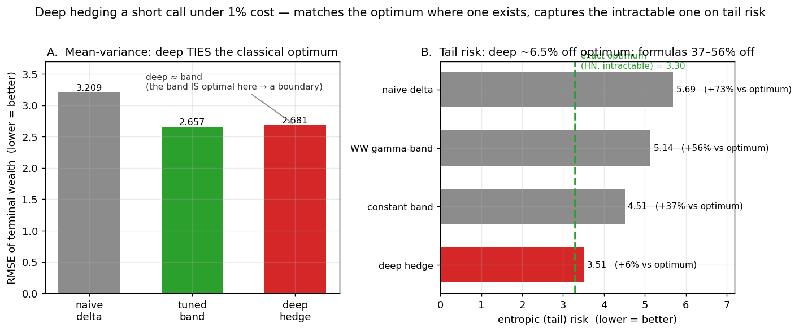

# Deep Hedging

> **A neural network learns to hedge an option by backpropagating through a differentiable market — no
> closed-form formula — and I measure it against the *exact* classical optimum wherever one exists.** It
> **recovers** Black–Scholes delta frictionlessly (std ratio 1.009) and **ties** the optimal no-trade band
> under transaction costs (±1%, because the band *is* the optimum there). The result is on **tail risk**:
> there the exact optimum (Hodges–Neuberger) is an intractable dynamic program, the hedges desks actually
> deploy (Whalley–Wilmott / no-trade bands) leave a **37–56%** gap to it, and the learned policy closes that
> to **6.5%**. Deep hedging's value is *practical*: near-optimal tail hedging where the optimum can't be
> computed and the textbook formula falls short. Trained by pathwise gradient — no RL, no PPO noise floor.

Companion to [RL Optimal Liquidation](../RL_Optimal_Liquidation). That project showed learned control *ties*
the classical optimum where the deployable method already **is** optimal (CE-AC) — a boundary. This one shows
**where learning starts to pay off**: where the deployable formula is far from an intractable optimum (tail
objectives, frictions). Together: *learned stochastic control matches classical optimality where it's
computable, and adds value exactly where the classical model's assumptions break.*



*The result in one figure (`python figures/make_figure.py`): **(A)** on average (mean-variance) risk the
deep hedge ties the correctly-implemented no-trade band — the band is optimal there, so it's a boundary;
**(B)** on tail risk it lands ~6% above the exact-but-intractable Hodges–Neuberger optimum, while the
deployable formulas (constant band, Whalley–Wilmott) sit 37–56% above it.*

## Results (post-audit; an adversarial review found & fixed a baseline bug — see PROJECT_STATUS)

| Phase | Result |
|---|---|
| **recover** (frictionless) | deep = BS delta: std ratio **1.009**, hedge-ratio MAE **0.008**. Validation. |
| **tie** (cost, mean-variance) | deep = correct edge-reflecting no-trade band, ±1% over 5 seeds. The band is the optimum here, so deep can only match it — a boundary. Beats naive delta +6/+16/+30%. |
| **win** (cost, tail objective) | deep within **6.5%** of the exact Hodges–Neuberger optimum (DP-certified); deployable bands **37–56%** above it. Same pattern under Merton jumps (**+16.5% CVaR₉₉** over Whalley–Wilmott). |

## Formulation

| | |
|---|---|
| **Contract** | short one European call, K=100, σ=0.2, T=1, r=0, N=30 dates (extensible; Asian variant in `asian_transformer.py`) |
| **State** | standardized moneyness log(S/K)/(σ√τ), moneyness, time-to-maturity, current holding |
| **Action** | stock holding δ each step |
| **Objective** | mean-variance / **entropic** (exp-utility) / CVaR |
| **Training** | pathwise gradient through a differentiable GBM/Merton simulator (Adam, cosine LR), GPU |
| **Baselines** | exact BS delta · Leland · edge-reflecting no-trade band · Whalley–Wilmott gamma-band · **exact Hodges–Neuberger optimum (DP)** · paired CRN eval, 200k paths + test-path bootstrap |

## Quickstart

```bash
python experiments/recover.py           # frictionless recovery of BS delta
python experiments/multiseed.py         # mean-variance: deep ties the correct band (boundary)
python experiments/win_test.py          # tail objective: deep vs constant & WW bands, GBM + jumps
python experiments/hn_dp.py             # exact Hodges-Neuberger optimum (DP) — certifies the gap (GBM)
python experiments/robustness.py        # vol misspecification + jumps
python experiments/asian_transformer.py # transformer vs FF on a path-dependent Asian option
```

Full account, mechanism, the audit correction, and how to defend it: [`PROJECT_STATUS.md`](PROJECT_STATUS.md),
[`INTERVIEW_NOTES.md`](INTERVIEW_NOTES.md).
